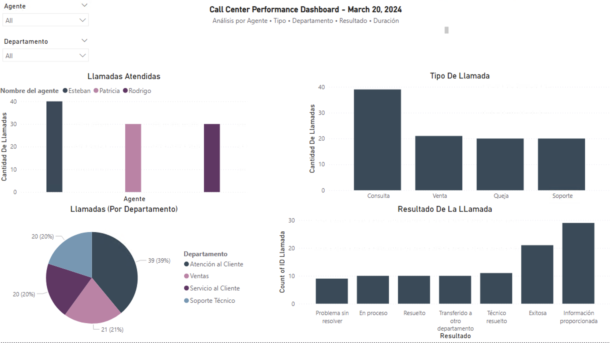
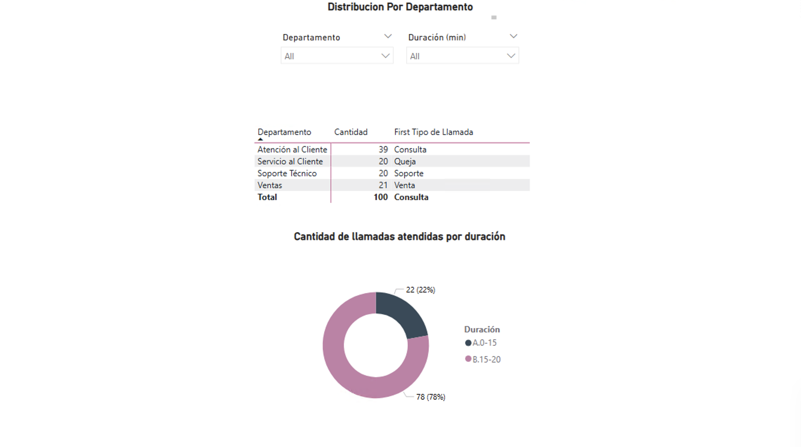

# Call Center Analytics – Power BI Dashboard
**University:** Universidad Cenfotec  
**Course:** Business Analytics  
**Author:** Jennifer Victoria Arriola Salazar

**Scope.** This report analyzes **100 calls** from **20/03/2024** to understand operational volume and outcomes by **Agent, Call Type, Department, Result, and Duration**. The dashboard is organized in two pages: an **Overview** (volume and outcomes with slicers) and a **Detail** page (matrix by department and duration distribution).

## Screenshots

  
*Agent • Type • Department • Result • Agent Slicer*

  
*Matrix by Department and Calls by Duration (Rango Duración)*

---

## Executive Summary (What the Dashboard Shows)
- **Volume by Agent.** One agent leads total handled calls; the other two are at similar levels.  
  *Dataset totals used to build the visuals: Agente 1 = 40, Agente 2 = 30, Agente 3 = 30 (out of 100).*
- **Call Reasons.** **Consulta** is the largest category, followed by **Venta**, **Soporte**, and **Queja**.  
  *Dataset totals: Consulta 39, Venta 21, Soporte 20, Queja 20.*
- **Where Work Happens.** **Atención al Cliente** concentrates the most calls; **Ventas**, **Soporte Técnico**, and **Servicio al Cliente** split the rest.  
  *Dataset totals: Atención al Cliente 39, Ventas 21, Soporte Técnico 20, Servicio al Cliente 20.*
- **Outcomes.** Most calls end in **Información proporcionada**; there is a healthy share of **Exitosa/Resuelto**; a small tail of **Problema sin resolver** remains.  
  *Dataset totals: Información proporcionada 29, Exitosa 21, Técnico resuelto 11, Transferido a otro departamento 10, Resuelto 10, En proceso 10, Problema sin resolver 9.*
- **Handle Time.** Duration distribution shows **two buckets**: **11–15 min (22%)** and **16–20 min (78%)**; there are **no** calls outside 11–20 minutes in this sample.

**Business implications.**
- Staffing/Capacity: One agent consistently carries the highest load (40% of calls).  
- Knowledge Management: With **Consulta** dominating, self‑service content (FAQs, knowledge base) could reduce inbound volume.  
- Outcome Quality: Strong share of resolved/information‑provided outcomes; unresolved cases warrant targeted review.  
- Efficiency: With 78% at 16–20 minutes, coaching or process adjustments could shift more volume into the 11–15 bucket.

> **Limitation:** This is a **single‑day** snapshot (20/03/2024). Trend/SLA analysis requires multi‑day data.

---

## What I Built (ETL → Model → Visuals)

### Data Preparation (ETL – Power Query)
- **Type enforcement:**  
  - `Fecha` **Date**; `Hora de inicio` / `Hora de finalización` **Time**  
  - `Duración (min)` and `ID Llamada` **Whole Number**  
  - Categorical fields (Agente, Tipo de Llamada, Resultado, Nivel de satisfacción, Departamento) **Text**
- **Cleaning:** Trimmed text, standardized categories.  
- **Feature engineering:**  
  - `FechaHoraInicio` = `Fecha` + `Hora de inicio` (**DateTime**)  
  - `FechaHoraFin` = `Fecha` + `Hora de finalización` (**DateTime**)  
  - `Duración calculada (min)` and **validation flag** `Duración correcta`  
  - **`Rango Duración`** buckets: `<=10`, `11–15`, `16–20`, `21–30`, `>30` (used in duration visuals)

### Data Model (Power BI)
- **Single fact table** of calls with dimensional attributes (Agent, Type, Department, Result).  
- **Core measure:** `Total Llamadas = COUNT([ID Llamada])`.  
- (Optional) % composition measures by Type/Result for quick benchmarking.

### Visual Design
- **Page 1:**  
  - Bar – Calls by **Agent**  
  - Column – Calls by **Type**  
  - Pie/Bar – Calls by **Department**  
  - Column – Calls by **Result**  
  - **Slicer** – Agent (and Department as an additional page control)
- **Page 2:**  
  - **Matrix** – Department with Count (plus a technical “First Tipo de Llamada” aggregation as placeholder)  
  - Donut – **Calls by Duration** (**Rango Duración**: shows 22% vs 78%)

---

## Key Metrics (from the dataset used to build the report)
- **Total calls:** 100  
- **By Agent:** 40 / 30 / 30  
- **By Type:** Consulta 39, Venta 21, Soporte 20, Queja 20  
- **By Department:** Atención al Cliente 39, Ventas 21, Soporte Técnico 20, Servicio al Cliente 20  
- **By Result:** Info. proporcionada 29, Exitosa 21, Técnico resuelto 11, Transferido a otro departamento 10, Resuelto 10, En proceso 10, Problema sin resolver 9  
- **By Duration (Rango):** 11–15 = 22; 16–20 = 78; others = 0

---

## Next Steps (Roadmap)
1. **Time Series:** Add more dates and a Date table to analyze trends, peaks, and SLA compliance.  
2. **Outcome Quality:** Replace “First Tipo de Llamada” in the matrix with **mode/Top N** or % breakdown; add KPIs for **% Exitosa/Resuelto**.  
3. **Efficiency:** Track **Average Handle Time (AHT)** over time and build agent‑level duration distributions for coaching.  
4. **Knowledge Base:** Use Consulta insights to design self‑service content; measure deflection.  
5. **Data Governance:** Standardize category taxonomies (Result/Department) to avoid drift as data scales.

---

## How to Use
1. Open `Proyecto_Final_Dashboard_Llamadas.pbix` (if included) or load the clean data from `/data` in Power BI Desktop.  
2. Confirm types (already enforced in the provided clean files).  
3. Interact with the **Agent slicer** on Page 1 and the **Department/Duration** slicers on Page 2.

---

## Repository Structure
``
